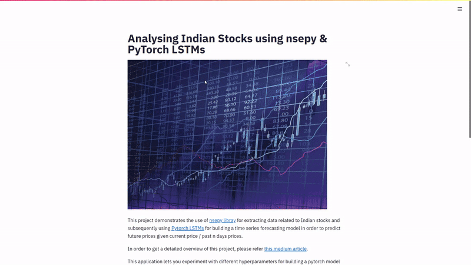

# Time series Analysis of Indian Stocks with LSTMs

The aim of this repo is to demonstrate the use of LSTMs as a tool to model time-series data for making stock forecasting. The data is scraped dynamically using [nsepy](), a library made to fetch data for Indian markets.



Finally, [streamlit]() is used to visualize the process of training in a web app as shown above. In order to reproduce this code on your system, you need to have the following installed on your system

- python 3.6+ (I have run on python 3.6, should work on higher versions)
- pytorch 1.4.0+
- pandas 1.0.1+
- numpy 1.18.1 +
- sklearn 0.22.1 +
- nsepy 0.8
- streamlit 0.69.2

Once you get these packages, you can clone this repository and run the app for yourself using the command

```
streamlit run forecasting.py
```

For understanding more on how the data is extracted and models are built, refer this [medium blog post]().

Thanks for your attention! Hope this repo helped you in some way :)